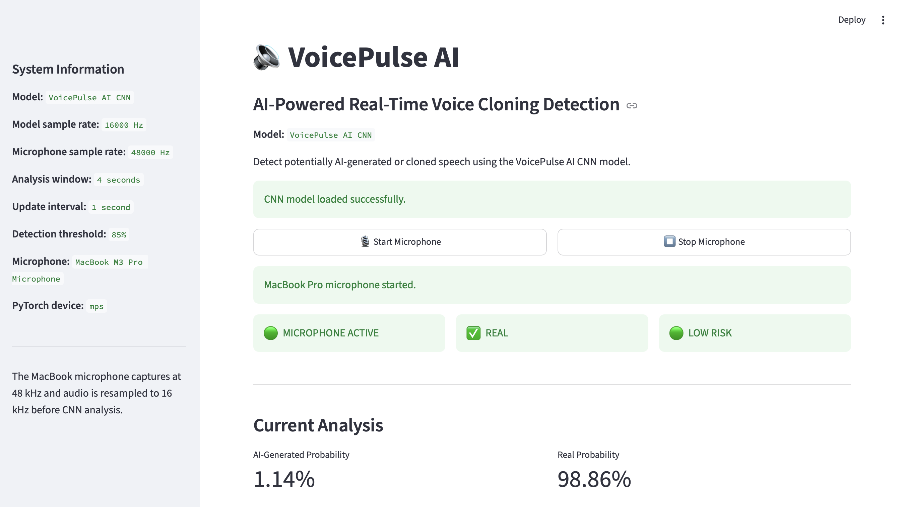
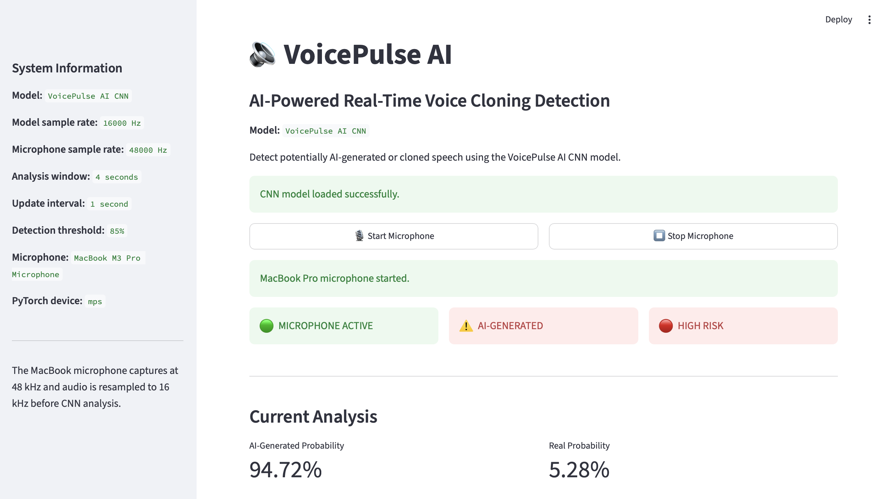

# VoicePulse AI

Real-time AI-generated voice detection using a custom CNN audio classifier.

VoicePulse AI captures microphone audio, converts it into a Mel-spectrogram representation, runs CNN inference on a rolling audio window, smooths consecutive predictions, and classifies the current segment as `REAL` or `AI-GENERATED`.

**Status:** Working local prototype with real-time MacBook microphone inference and a Streamlit dashboard.

---

## What the Project Does

The current implementation provides an end-to-end voice classification pipeline:

```text
MacBook Microphone
        ↓
48 kHz Audio Capture
        ↓
Resampling to 16 kHz
        ↓
4-Second Analysis Window
        ↓
Mel-Spectrogram Extraction
        ↓
Custom CNN
        ↓
AI-Generation Probability
        ↓
2-Window Smoothing
        ↓
0.85 Decision Threshold
        ↓
REAL / AI-GENERATED
        ↓
Streamlit Dashboard
```

---
## Architecture

```mermaid
flowchart TD
    A[MacBook Pro Microphone<br/>48 kHz] --> B[Audio Capture]
    B --> C[Resampling<br/>48 kHz → 16 kHz]
    C --> D[Rolling 4-Second Window]
    D --> E[Mel-Spectrogram<br/>64 Mel Bands]
    E --> F[Normalization]
    F --> G[Custom CNN]
    G --> H[AI-Generation Probability]
    H --> I[2-Window Smoothing]
    I --> J{Probability >= 0.85?}
    J -->|Yes| K[AI-GENERATED]
    J -->|No| L[REAL]
    K --> M[Risk Classification]
    L --> M
    M --> N[Streamlit Dashboard]


## Model

VoicePulse AI uses a custom convolutional neural network trained for binary classification:

```text
Class 0 → Real
Class 1 → AI-generated
```

The network contains four convolutional blocks followed by adaptive global average pooling and a fully connected classifier.

The live application loads the trained CNN checkpoint and performs inference on normalized Mel-spectrogram features.

---

## Model Development

The completed development workflow includes:

### Training

The CNN was trained using **ASVspoof2019** data.

### External Evaluation

The trained model was evaluated using **ASVspoof2021-DF** data to test performance outside the original training data.

### Local Fine-Tuning

The CNN was fine-tuned using local real and AI-generated recordings.

### Recording-Level Validation

A **5-fold recording-level cross-validation** workflow was implemented and used for local validation.

### Threshold Calibration

The live decision threshold was calibrated and set to:

```text
0.85
```

The live classifier therefore uses:

```text
AI probability >= 0.85 → AI-GENERATED
AI probability <  0.85 → REAL
```

---

## Validation Results

The completed local validation experiment produced:

| Metric    |  Result |
| --------- | ------: |
| Accuracy  |  98.46% |
| Precision | 100.00% |
| Recall    |  96.15% |
| F1-score  |  98.04% |

These results correspond to the validation experiment used during development. They should not be interpreted as universal performance across all speakers, microphones, codecs, or future voice-generation systems.

---

## Real-Time Detection

The current live application uses the MacBook Pro built-in microphone.

Configuration:

| Parameter              |     Value |
| ---------------------- | --------: |
| Microphone sample rate |    48 kHz |
| Model sample rate      |    16 kHz |
| Analysis window        | 4 seconds |
| Update interval        |  1 second |
| Mel bands              |        64 |
| FFT size               |      1024 |
| Hop length             |       256 |
| Probability smoothing  | 2 windows |
| Detection threshold    |      0.85 |

The dashboard continuously updates the displayed probability and classification as new audio becomes available.

---
## Dashboard

The Streamlit dashboard currently displays:

* microphone status
* current `REAL` / `AI-GENERATED` classification
* AI-generated probability
* real probability
* risk level
* model and audio configuration
* current analysis state

The dashboard is designed for local real-time testing with the MacBook microphone.

---
## Live Dashboard

### Real Voice Detection



### AI-Generated Voice Detection



## Testing

The repository contains automated tests for the audio-processing and decision layers.

Current test coverage includes:

* audio-window padding
* audio-window trimming
* exact-window handling
* threshold behavior below 0.85
* threshold behavior at 0.85
* threshold behavior above 0.85
* risk classification

Current status:

```text
7 tests
7 passed
```

Run them with:

```bash
PYTHONPATH=src python -m unittest discover -s tests -v
```

---

## Repository Structure

```text
VoicePulse-AI/
│
├── src/
│   ├── voicepulse/
│   │   ├── __init__.py
│   │   ├── audio.py
│   │   ├── config.py
│   │   ├── dashboard.py
│   │   ├── decision.py
│   │   ├── inference.py
│   │   ├── microphone.py
│   │   └── model.py
│   │
│   └── voicepulse_ai_dashboard.py
│
├── scripts/
│   ├── train_cnn.py
│   ├── train_cnn_asvspoof2019.py
│   ├── finetune_cnn_local.py
│   ├── local_cross_validation.py
│   ├── evaluate_finetuned_recording.py
│   └── evaluate_local_domain.py
│
├── tests/
│   ├── test_audio.py
│   └── test_decision.py
│
├── README.md
├── requirements.txt
├── LICENSE
└── .gitignore
```

---

## Installation

Clone the repository:

```bash
git clone https://github.com/ashvikagowda/VoicePulse-AI.git
cd VoicePulse-AI
```

Create a virtual environment:

```bash
python3 -m venv .venv
source .venv/bin/activate
```

Install dependencies:

```bash
pip install -r requirements.txt
```

---

## Running the Dashboard

The trained model checkpoint is intentionally excluded from GitHub.

The application expects the checkpoint at:

```text
models/cnn/voicepulse_ai_cnn.pth
```

After placing the checkpoint locally, run:

```bash
streamlit run src/voicepulse_ai_dashboard.py
```

The current implementation is intended for local MacBook microphone testing.

---

## Limitations

VoicePulse AI is a **research and portfolio prototype**.

The current implementation does not provide definitive proof that a voice has been cloned. Model performance can vary with speakers, recording conditions, microphones, codecs, and synthetic-voice generators that were not represented in the development data.

The current live interface also uses microphone input rather than direct telephony or VoIP integration.

---

## Technology Stack

* Python
* PyTorch
* Librosa
* NumPy
* SoundDevice
* SoundFile
* Scikit-learn
* Hugging Face Datasets
* Streamlit

---

## Author

**Ashvika Gowda**

B.E. - Internet of Things, Cybersecurity with Blockchain

